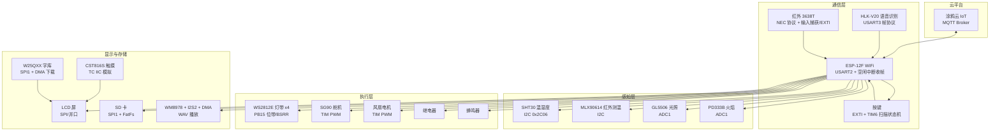

# STM32F405 智能家居控制台

基于 **STM32F405VGTx** 的智能家居项目：环境监测（温湿度 / 红外测温 / 光照 / 火焰）、云端 MQTT 远程控制、语音识别、红外遥控、音乐播放与 WS2812E 氛围灯，数据在 LCD 屏实时显示。

> 本文档由系统架构、环境搭建、软件架构、命名规范、Bug 排查记录、已知问题与未来规划六个部分构成，建议结合提交历史（`git log`）阅读。

---

## 1. 系统架构

### 1.1 总体框图



### 1.2 主循环软件架构（`user/main.c`）

主循环是一个**轮询式事件总线**：每个周期依次处理云端下行、语音指令、云端上行、红外命令。


### 1.3 核心状态机

| 状态机 | 位置 | 说明 |
|---|---|---|
| 按键状态机 | `api/key.c` | `IDLE → DEBOUNCE → PRESSED → RELEASE`，30ms 消抖（TIM6 10ms 扫描），事件：PRESS / SHORT_PRESS / LONG_PRESS（阈值 1000ms） |
| 云端上报 busy 状态机 | `api/debug.c` | `pub_busy + pub_sel + last_pub`：10s 间隔轮询 5 类数据（tem/hu/human_tem/illumination/fire），等待 ESP 应答，3s 超时释放 busy |
| 音乐播放状态机 | `status_dev.PlayState` | `PLAY_STOP / PLAY_PLAY / PLAY_NEXT / PLAY_PREVIOUS`，云端 `{"music":0~3}` 与红外/按键共同驱动 |
| 红外命令标志 | `api/infrared.c` | 中断里只置 `deal_ir_flag`，主循环 `deal_if()` 统一消费，避免中断里执行耗时操作 |

#### 1.3.1 音乐播放状态机设计

> 非阻塞播放：DMA 中断只置信号，主循环每圈消费。原 `while(res==0)` 阻塞播放已移除，播放期间触摸 / 云端指令 / 红外照常响应。

**两层状态设计**

| 层 | 载体 | 职责 | 写入方 |
|---|---|---|---|
| 命令层 | `status_dev.PlayState`（PLAY_*） | 一次性请求：播放 / 暂停 / 上一曲 / 下一曲 / 停止 | 云端、红外中断、按键、触摸随时置位；状态机消费后清回 `PLAY_CLEAR` |
| 状态层 | `wav_phase`（WAV_*） | 播放当前所处阶段 | 仅 `Wav_PlayStep()` / `Wav_PlaySong()` 修改 |

**四态转移图**（`wavplay.h` 的 `wav_phase_t`）

```
                 Wav_PlaySong() 成功
            （分配内存 + 解析WAV头 + 预填2帧）
        ┌──────────────────────────────────┐
        ▼                                  │
  WAV_IDLE ─▶ WAV_FILLING ─PLAY_PAUSE─▶ WAV_PAUSED
        ▲          │      ◀PLAY_PLAY─┘     │
        │          ▼                       │
        │  fillnum_last != BUFSIZE（播完）  │
        │  return WAV_END                  │
        └── WAV_IDLE（上层 curindex++ 自动下一首）
  PLAY_STOP ─▶ WAV_STOPPED（驻留，必须再发播放指令才重开）
  PLAY_PREVIOUS / PLAY_NEXT ─▶ WAV_IDLE（上层切索引后重开）
```

| 状态 | 含义 |
|---|---|
| WAV_IDLE | 无曲在播，`Audio_MusicStep` 自动打开 `curindex` 曲目（开机首播 / 播完循环 / 切歌重开） |
| WAV_FILLING | 播放中，每帧执行：等 DMA 空缓冲 → 填充 → 消费命令 |
| WAV_PAUSED | 暂停，不填充，但命令照常消费（暂停中可恢复 / 切歌 / 停止） |
| WAV_STOPPED | 显式停止，不自动重开，等 `PLAY_PLAY` 才恢复 |

**单帧处理流程**（`Wav_PlayStep()`，主循环每圈调用一次）

1. 先消费命令：PAUSE 清播放位 → WAV_PAUSED；PLAY 恢复 → 回 WAV_FILLING；PREV / NEXT 关停释放 → WAV_IDLE 并返回给上层切索引；STOP 关停释放 → WAV_STOPPED
2. 暂停 / 停止态 → 直接返回（不填充）
3. `wavtransferend == 0`（DMA 缓冲未空）→ 返回，下轮再看
4. `fillnum_last != BUFSIZE` → 播完：关停 + 释放 → WAV_IDLE → 返回 `WAV_END`（上层自动下一首）
5. 填充空出的缓冲，`fillnum_last = 实际读取字节数`

**关键设计**

- **非阻塞的"等待"**：原 `while(wavtransferend==0)` 阻塞改为 `if (wavtransferend==0) return 0;`，信号由 DMA 回调置位、主循环消费清零；暂停期间信号悬置，恢复后下一圈正好可用
- **`fillnum_last` 双帧预填**：预填 buf1 / buf2 两帧，播完判断永远滞后一帧，保证最后一帧完整播完才停
- **命令优先于暂停判断**：`Wav_PlayStep` 先查 `PlayState` 再查 `wav_phase`，暂停中才能响应恢复 / 切歌 / 停止
- **`WAV_END = 0xFE`**：播放结束返回码与 `PLAY_*` 枚举（`PLAY_PREVIOUS == 1`）值域错开，防止播完被误判为"上一曲"
- **STOPPED ≠ IDLE**：IDLE 是自动续播入口（播完 / 切歌后无需指令），STOPPED 是强制驻留，除非再发播放指令

**调用链**：`main.c` 主循环 `Audio_MusicStep()` →（无曲时）`Wav_PlaySong()` 开歌 /（播放中）`Wav_PlayStep()` 驱动 → DMA 中断 `Wav_I2sDmaTx_Callback()` 只置 `wavtransferend` / `wavwitchbuf`

### 1.4 中断资源

| 中断 | 用途 |
|---|---|
| USART2 RXNE + IDLE | ESP-12F 收帧：空闲中断判定一帧结束，`str2_buf` 补 `\0` 后置 `idle_flag` |
| USART1 | `printf` 重定向（串口调试） |
| USART3 | HLK-V20 语音模块帧接收 |
| EXTI + TIM6 | 按键按下中断 + 10ms 扫描消抖 |
| 红外 EXTI / 输入捕获 | NEC 协议解码（注意：输入捕获与 WS2812E 共用 TIM3_CH3，当前已注释禁用） |
| I2S2 TX DMA | WAV 音频播放 |

### 1.5 中断优先级分配

分组配置：`main.c` 中 `NVIC_PriorityGroupConfig(NVIC_PriorityGroup_3)` → **3 位抢占优先级（0~7）+ 1 位子优先级（0~1）**

| 抢占 | 子 | IRQ | 位置 | 用途 |
|---|---|---|---|---|
| **1** | 0 | `TIM6_DAC_IRQn` | [tim.c:74](user/api/tim.c#L74) | 系统节拍 `GetTim6Tick` + 按键扫描定时 |
| **1** | 0 | `TIM1_BRK_TIM9_IRQn` | [infrared.c:57](user/api/infrared.c#L57) | 红外 NEC 解码计时（时间关键，丢帧即整帧错乱） |
| **2** | 1 | `DMA1_Stream4_IRQn` | [i2s.c:152](user/ASR_MIC/i2s.c#L152) | I2S2 TX DMA 音频播放（双缓冲切换，保证音频连续） |
| 3 | 0 | `USART2_IRQn` | [esp-12f.c:39](user/api/esp-12f.c#L39) | ESP-12F 云通信（空闲中断收帧） |
| 3 | 0 | `USART3_IRQn` | [hlk_v20.c:34](user/api/hlk_v20.c#L34) | HLK-V20 语音帧接收 |
| 3 | 0 | `EXTI0_IRQn` | [key.c:114](user/api/key.c#L114) | 按键触发 |
| 3 | 0 | `TIM1_UP_TIM10_IRQn` | [key.c:218](user/api/key.c#L218) | 按键扫描/长按计时（`key_scan_tim_ini`） |
| 3 | 0 | `RTC_Alarm_IRQn` | [rtc.c:195](user/api/rtc.c#L195) | RTC 闹钟 |
| 3 | 0 | `RTC_WKUP_IRQn` | [rtc.c:248](user/api/rtc.c#L248) | RTC 周期唤醒 |
| 3 | 0 | `EXTI1_IRQn` | [tc_iic.c:46](user/api/tc_iic.c#L46) | CST816S 触摸中断 |
| 3 | 0 | `TIM3_IRQn` | [tim.c:211](user/api/tim.c#L211) | 输入捕获（与 WS2812E 共用 TIM3_CH3，当前禁用） |
| — | — | `DMA2_Stream5_IRQn` | [dma.c:254](user/api/dma.c#L254) | 串口 1 字库下载双缓冲 DMA（`DMA_Font_Config`，当前注释） |
| — | — | `DMA2_Stream2_IRQn` | [dma.c:200](user/api/dma.c#L200) | USART1 RX DMA（`dma2_stream2_ini`，预留未用） |

分配原则：

1. **抢占优先级只分三档**：`1`（时间关键，丢帧即错——系统节拍、红外时序）→ `2`（音频 DMA，保证播放连续）→ `3`（通信/交互，丢一拍可重发/轮询补偿）。

2. 子优先级只出现 0/1 两档：同抢占级内的中断按子优先级裁决（当前抢占 3 组内全为子 0；抢占 1 组内 TIM6/TIM9 为子 0、字库 DMA 为子 1）。**若改分组，需重审全部优先级**。

3. USART1 仅做 `printf` 输出，接收中断已关闭（提交 `28653a7`），接收可走 DMA（预留）。

   

### 1.6 内存分配

| 区域 | 大小 | 说明 |
|---|---|---|
| 启动文件栈 `Stack_Size` | **4KB** | [startup_stm32f40_41xxx.s](startup/startup_stm32f40_41xxx.s)，提交 `0e54388` 调整过 |
| 启动文件堆 `Heap_Size` | **8KB** | 同上（`malloc`/`printf` 浮点等使用） |
| MEM1（内部 SRAM） | **60KB** | 正点原子风格分块内存池，块 32B，16bit map 状态表（~2.56KB）；从 100KB 砍到 60KB 省内存 |
| MEM2（外部 SRAM） | 960KB | `mymalloc.h` 预留定义，当前板未用 |
| MEM3（CCM 内存） | 60KB | 仅供 CPU 直访                                                |
| 音频 DMA 缓冲 | 2 × **8KB** | `WAV_I2S_TX_DMA_BUFSIZE = 8192`（[wavplay.h](user/ASR_MIC/wavplay.h)），双缓冲，192Kbps@24bit 时需 8192 才不卡 |

内存池管理（[mymalloc.h](user/ASR_MIC/mymalloc.h) / [mymalloc.c](user/ASR_MIC/mymalloc.c)）：

- 三个池共用一套结构 `mallco_dev`：`membase`（池基址）+ `memmap`（16bit 分配状态表）+ `memrdy`（就绪标志）。
- 内部接口：`my_mem_init` / `my_mem_malloc` / `my_mem_free` / `my_mem_perused`（内存使用率）。
- 用户封装：`mymalloc(memx, size)` / `myfree` / `myrealloc`，`memx` 传 `SRAMIN / SRAMEX / SRAMCCM`。

实际使用场景：

| 场景 | 分配 | 池 |
|---|---|---|
| 音乐播放（[revert.c](user/ASR_MIC/revert.c)） | `audiodev1.file`（FIL）+ `i2sbuf1/i2sbuf2` 双缓冲（各 8KB） | SRAMIN |
| 文件倒放（[revert.c](user/ASR_MIC/revert.c)） | `FIL` 对象 + 512B 数据缓冲（CPU 直访，无 DMA 需求 → 放 CCM） | SRAMCCM |
| 曲目列表（[audioplay.c](user/ASR_MIC/audioplay.c)） | `pname` 曲目路径表 + `wavindextbl` 索引表 | SRAMIN |

> 注：LCD 字库**不占用 RAM**——通过串口 1 DMA 双缓冲下载后写入 W25QXX 外部 Flash（`DMA_Font_Config` + `Font_Load`，当前为省时默认注释）。

---

## 2. 环境搭建步骤

### 2.1 目录依赖

| 目录 | 内容 | 说明 |
|---|---|---|
| `lib/` | STM32F4xx 标准外设库（`inc/` 头文件、`src/` 源码） | 标准库，**非** HAL 库 |
| `startup/` | `startup_stm32f40_41xxx.s` 启动文件 | 中断向量表 |
| `user/` | 用户源码（驱动 + 应用） | 见后文 |
| `project/` | Keil MDK5 工程文件 | 打开 `project.uvprojx` |

### 2.2 软件安装

1. **Keil MDK5**（本机路径 `D:\keil5core`，ARMCC 编译器）。
2. 打开工程：`project/project.uvprojx`，目标 `Target 1`。
3. 工程配置要点：
   - Device：**STM32F405VGTx**（Cortex-M4F，HSE 12MHz，PLL 倍频到 168MHz）。
   - 宏定义：`STM32F40_41xxx`、`USE_STDPERIPH_DRIVER`。
   - 包含路径：`user`、`user/api`、`user/ff14b/source`、`user/ASR_MIC`、`startup`、`lib/inc`、`lib/src`。
   - 输出：`project/project.hex`（可直接烧录）。
5. 烧录调试：ST-Link / J-Link 下载 `project.hex`。

### 2.3 硬件接线与资源准备

| 外设 | 接口 | 备注 |
|---|---|---|
| ESP-12F | USART2 | 波特率 115200，AT + MQTT 透传 |
| HLK-V20 | USART3 | 波特率 115200，自定义帧协议 |
| WS2812E | PB15 | 4 颗灯珠，BSRR 位操作 |
| SHT30 / MLX90614 | I2C 主机（PB6/PB7） | SHT30 命令 `0x2C06` |
| SD 卡 / W25QXX | SPI1 | 同一 SPI 总线，模式不同（W25 为 mode0，SD 为 mode3） |
| WM8978 | I2S2 + I2C 控制 | 44.1kHz / 16bit WAV |
| LCD + CST816S | 并口/SPI + TC IIC 模拟 | 触摸屏 |
| GL5506 / PD333B | ADC1 | 光照、火焰 |
| SG90 / 风扇 | TIM PWM | 舵机 20ms 周期，风扇 1kHz |

### 2.4 烧录前准备

1. **SD 卡**：FAT32 格式化，根目录放 WAV 音频文件（44.1kHz/16bit）。
2. **字库**：如需 LCD 中文显示，先执行 `DMA_Font_Config()` + `Font_Load()` 将字库下载到 W25QXX（当前为省时默认注释）。
3. **WiFi 与云平台**：修改 `esp_12f_ini()` 中的 `AT+CWJAP` 账号密码，以及 `AT+MQTTUSERCFG` 三元组（涂鸦云 deviceID / clientID / secret）、`AT+MQTTCONN` broker 地址。
4. **对时**：RTC 初始化时按**编译时间**校准（`RTC_Cal_Config()`）。

---

## 3. 软件架构

```
train1/
├── README.md
├── lib/                      # STM32F4xx 标准外设库（第三方，勿改）
│   ├── inc/                  #   标准库头文件
│   └── src/                  #   标准库源码
├── startup/
│   └── startup_stm32f40_41xxx.s   # 启动文件（中断向量表）
├── project/                  # Keil MDK5 工程
│   ├── project.uvprojx       #   工程文件（打开此文件编译）
│   ├── .vscode/              #   VSCode + keil-assistant 配置
│   ├── RTE/                  #   运行环境组件（空壳）
│   ├── Objects/ Listings/    #   编译输出（.o/.axf/.hex/.map）
│   └── *.crf *.o *.hex ...   #   产物，随 git 索引提交
└── user/                     # 用户代码（核心）
    ├── main.c                #   主程序：初始化 + 主循环事件总线
    ├── main.h                #   全局头文件集中包含
    ├── api/                  #   ★ 驱动层（按硬件命名，每硬件一对 .c/.h）
    │   ├── LED / ws2812e     #   WS2812E 灯带（PB15 位带 + BSRR）
    │   ├── SHT30 / MLX90614  #   I2C 温湿度 / 红外测温
    │   ├── gl5506 / pd333b   #   ADC 光照 / 火焰传感器
    │   ├── sg90 / motor / relay / beep   # 舵机 / 风扇 / 继电器 / 蜂鸣器
    │   ├── key               #   按键状态机（EXTI + TIM6 扫描）
    │   ├── infrared          #   红外 NEC 解码 + 命令分发
    │   ├── lcd / font / font1 / tc_iic   # 屏显示 / 字库 / 触摸
    │   ├── rtc               #   时钟 + 闹钟 + 周期唤醒
    │   ├── sd_driver / w25qxx / spi / dma   # 存储与外设总线
    │   ├── esp-12f           #   WiFi + MQTT 云通信（收/发 JSON）
    │   ├── hlk_v20           #   语音识别模块驱动
    │   ├── i2c / usart1 / tim / delay / sys / debug / adc
    │   └── bitband / io_bit  #   位带 / 位操作宏
    ├── ASR_MIC/              #   音频栈
    │   ├── wm8978 / i2s / wavplay / audioplay   # 音频编解码与播放
    │   └── mymalloc / revert
    └── ff14b/                #   FatFs 文件系统源码（第三方）
        └── source/           #   ff.c / diskio.c / exfuns.c ...
```

---

## 4. 命名规范

| 类别 | 规范 | 示例 |
|---|---|---|
| 文件命名 | 以硬件/模块名命名，一对 `.c/.h` | `ws2812e.c`、`SHT30.c`、`esp-12f.c`、`hlk_v20.c` |
| 头文件防护 | `#ifndef __模块名_` / `#define` | `__ESP_12F_`、`_KEY_` |
| 初始化函数 | `模块_ini()` / `模块_Config()` / `模块_Init()` 混用（新代码倾向 `_ini`） | `key_ini()`、`Usart1_Config()`、`LCD_Init()` |
| 业务函数 | 小驼峰，动词开头 | `esp_analysis()`、`Tcloud_report()`、`wifi_send_command()` |
| 中断服务函数 | `XX_IRQHandler`（Keil 启动文件约定） | `USART2_IRQHandler` |
| 宏 | 全大写 + 下划线 | `KEY_EVENT_LONG_PRESS`、`PB15_HIGH()`、`LED1_ON` |
| 类型别名 | `xxx_t` 后缀 + 枚举 | `KeyState_t`、`Key_t`、`status_dev` |
| 返回码 | 宏定义：`OK=0` / `OUT=1`（超时）/ `ERROR=2` | `wifi_send_command()` 返回值，`check()` 打印 |
| 中断共享变量 | `volatile` 修饰 | `idle_flag`、`str2_buf`、`deal_ir_flag` |
| 全局设备状态 | 集中放 `status_dev` 结构体 | `status_dev.PlayState`、`status_dev.volume` |
| 注释语言 | 中文（GBK / UTF-8 混用，注意编码） | main.c 为 GBK，api/ 部分为 UTF-8 |
| 位操作 | `io_bit.h` / `bitband.h` 位带，BSRR 直接赋值（避免 `|=` 的读-改-写） | `PB15_HIGH()` |

---

## 5. Bug 排查逻辑记录

> 从提交历史与排查注释中提炼，供后续遇到同类问题快速定位。

### 5.1 WS2812E 上电复位闪绿灯 ⚠️（硬件问题，未解决）

- **现象**：复位后第一个灯珠闪一下绿灯（`a863ca6` 发现，`041bdb1` 排查）。
- **排查排除项**：~~RTC~~、~~软件时序~~ —— 已确认不是 RTC 或 delay 校准引起（勿再排查）。
- **根因**：WS2812E 的 DIN 内部下拉约 100kΩ，STM32 上电复位期间（SystemInit/PLL 起振前 PB15 输入浮空）被 PCB 走线或外部上拉抬高到高电平，灯珠在 MCU 完全可控前就锁存了「绿色」。
- **结论**：`main()` 里无法解决（复位到 main 之间 PB15 不可控），**只能硬件解决**（DIN 加外部强下拉电阻等）。
- 另一同类问题：复位后第一个灯**常亮** —— 已通过 `delay.c` 的 NOP 校准修复（`25da08b`、`6b3b087`）。

### 5.2 SPI 复位后第一次事务没有下降沿（已修复）

- **现象**：SPI 初始化后第一次片选事务失败。
- **根因**：片选输出初始化后默认电平错误——初始化完成后 CS 必须输出**高**，否则复位后第一次事务无下降沿。
- **修复**：`4647cf0`（片选先置高）。

### 5.3 SHT30 读取异常（-45 / 0）（已定位，注意时钟拉伸）

- `0x2C06` 命令 + SCL 释放等待（当前实现）读取正常；`0x2400` 无 `Delay_Ms(20)` 时会 NACK → 读出 -45/0。
- 只要主机尊重真实 SCL 电平（等待时钟拉伸结束）就不会把总线卡死（I2C 挂死）。

### 5.4 MLX90614 测温偏 0.5℃（已澄清，非驱动 bug）

- 对比 demo 项目时出现的「0.5°C 偏移」：demo 读的是 MLX90614 红外表面温度，不是本驱动 bug。出现温差时先确认对比对象。

### 5.5 串口收帧：空闲中断 + 补 `\0`（防止 strstr 越界）

- ESP-12F 回包用 `USART2` 的 **RXNE + IDLE 空闲中断**收帧：空闲中断判定一帧结束，`str2_buf[i] = '\0'` 后再置 `idle_flag`，否则 `strstr()` 会读到脏数据。
- 命令发送统一走 `wifi_send_command(cmd, rev, timeout)`：发命令 → 等 `idle_flag` → 校验返回码（OK/ERROR）→ **超时返回 OUT**，防止卡死（`bd724f9` 增加超时，中途 Revert 后又 Reapply，`189a696`/`9331f64`）。

### 5.6 按键长按状态机出现 bug（已修复）

- 长按切换下一首期间出现异常（`4c32c4f`）。状态机要点：**中断里只置标志，事件消费放到主循环**；`KEY_STATE_RELEASE` 判定短按/长按后再发事件，避免抖动重报。

### 5.7 偶发「离奇报错」与「断电恢复」

- 变量名相同却报未定义（`7f4f71c`）：重写一遍即恢复，多为工程文件缓存/编码问题。
- 断电后功能突然正常（`c1c39ab`）：典型复位时序类偶发问题，优先检查上电时序与初始化顺序。

### 5.8 排查方法论沉淀

1. 先确认**硬件可控性**（如 5.1），再查软件 —— WS2812E 这类纯时序外设尤其如此。
2. 复用标志位（`idle_flag`）必须 `volatile`，且「消费方清零、生产方置位」要单一。
3. 主循环状态机遵守 **busy + 权限 + 骨架** 原则（main.c 注释）：一次只放行一个耗时事务，避免 10s 周期上报与下行命令互相打断。
4. 中断服务函数保持轻量，耗时逻辑（播放/控制）交给主循环消费。

---

## 6. 已知问题与未来规划

### 6.1 已知问题

| # | 问题 | 状态 | 说明 |
|---|---|---|---|
| 1 | WS2812E 上电复位闪绿灯 | 🚫 硬件问题 | 只能硬件解决（见 §5.1） |
| 2 | 输入捕获与 WS2812E 共用 TIM3_CH3 | ⏸️ 已规避 | `in_cap_ini` 注释禁用，红外改为 EXTI 解码 |
| 3 | 云端下行与周期上报的 busy 冲突 | ⚠️ 有分析 | main.c 注释已分析：下行命令可能被 busy 吃掉，当前以轮询顺序规避 |
| 4 | 音乐播放默认关闭 | ⏸️ 已注释 | `Audio_MusicPlay()` 默认注释，由云端/红外命令触发 |
| 5 | 字库 DMA 下载默认关闭 | ⏸️ 已注释 | `Font_Load()` 注释，省启动时间 |
| 6 | 源码编码混用 | ⚠️ 需注意 | main.c 为 GBK，api/ 部分为 UTF-8，跨工具编辑易乱码 |

### 6.2 未来规划（依据提交轨迹）

- [x] 基础驱动：点灯 → 串口 → 舵机 → 蜂鸣器 → 风扇 → ADC 光照/火焰 → WS2812E

- [x] RTC 实时钟 + 闹钟 + 周期唤醒，编译时间自动对时

- [x] LCD 显示 + 触摸 + 中英文滚动显示 + 时间实时刷新

- [x] SD 卡 + FatFs 文件系统 + WAV 音乐播放（WM8978 + I2S2 + DMA）

- [x] WiFi 联网（ESP-12F）+ 涂鸦云 MQTT 收发 + 5 类数据周期上报

- [x] 语音识别（HLK-V20）控制风扇、红外遥控切歌/暂停/播放、按键长按切歌

- [x] 播放 / 上一首 / 下一首 位图数据

- [x] 修复按键长按状态机 bug，完成音乐播放与状态显示的完整联动

- [x] 优化云端 busy 冲突：下行命令优先于周期上报，实现实时控制

- [x] 完善 LCD 歌曲名中文显示（当前曾出现红块问题）

- [x] 扩展语音指令集（灯光、窗帘、温度播报等）

  

